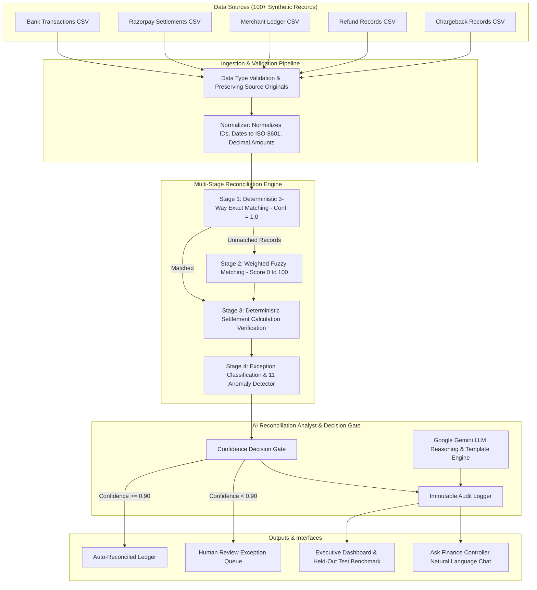

# RazorRecon AI — Autonomous AI Finance Controller

> **Razorpay AI Buildathon — Track 04: AI Finance Controller**
> *"An AI Finance Controller that verifies financial truth and knows when NOT to make a decision."*

> **Production status:** this build has been hardened beyond the original
> hackathon submission — JWT auth + RBAC, DB-persisted audit trail, real
> Razorpay API/webhook integration, PostgreSQL + Alembic migrations,
> rate limiting, structured logging, and hardened Docker images. See
> **[PRODUCTION.md](./PRODUCTION.md)** for the full before/after, deployment
> steps, and what still requires your own credentials/infra decisions.

---

## Executive Summary

RazorRecon AI is an enterprise-grade autonomous financial reconciliation engine built for high-throughput merchant payment operations. It ingests financial data across **5 heterogeneous sources**:

1. **Bank Transaction Statements** (`bank_transactions.csv`)
2. **Razorpay Settlement Records** (`razorpay_settlements.csv`)
3. **Merchant Internal Ledger** (`internal_ledger.csv`)
4. **Customer Refund Records** (`refunds.csv`)
5. **Chargeback & Dispute Records** (`chargebacks.csv`)

### Key Value Proposition: Controlled Autonomy & Precision First

In financial engineering, **a wrong match is significantly worse than an unresolved match**. RazorRecon AI enforces a strict precision-first decision gate:
- **Auto-Reconciliation Rate**: Transactions matching deterministic rules + high confidence ($\ge 0.90$) are processed instantly.
- **AI-Assisted Review**: Transactions with confidence between $0.75$ and $0.89$ are pre-analyzed with structured reasoning.
- **Human-in-the-Loop Safety Gate**: Any match under $0.90$ confidence or containing unverified variances is **refused automatic approval** and escalated with plain-English evidence:
  > `"UNRESOLVED — HUMAN REVIEW REQUIRED"`

---

## Core System Architecture



---

## AI Design Philosophy: Deterministic Arithmetic vs LLM Reasoning

> **Rule 1**: Financial calculations MUST NEVER depend on an LLM.

RazorRecon AI segregates responsibilities strictly:

| Domain | Method | Responsibilities |
|---|---|---|
| **Calculations** | Python `Decimal` Arithmetic | Gross - Fee - Tax = Net verification, date proximity calculation, amount similarity scoring |
| **Logic Gates** | Hardcoded Threshold Rules | Confidence gating ($\ge 0.90$), exact payment ID matching, duplicate detection |
| **AI Reasoning** | Google Gemini / Structured Analyst | Interpreting ambiguous discrepancies, generating plain-English explanations, recommending next actions |

---

## Data Model & Anomaly Benchmark Dataset

The synthetic dataset contains **120+ realistic Indian merchant transactions** intentionally injected with 11 anomaly types:

1. **Exact Matches** (~70%) — Bank, settlement, and ledger agree perfectly
2. **Amount Mismatches** (~8%) — Small rounding or recording variances
3. **Date Mismatches** (~5%) — Delayed settlements beyond allowed 3-day window
4. **Missing in Settlement** (~5%) — Present in bank and ledger but missing in Razorpay report
5. **Missing in Ledger** (~3%) — Present in bank and settlement but absent from merchant DB
6. **Duplicate Transactions** (~3%) — Double ledger entries with minor amount variations
7. **Formatting Differences** (~3%) — Casing, whitespace, or prefix differences (`PAY_0095` vs `pay_0095 `)
8. **Refunds** (8 records) — Linked customer refunds
9. **Chargebacks** (4 records) — Fraud/dispute chargebacks
10. **Partial Settlements** (~2 records) — Net settlement less than gross minus recorded fee/tax
11. **Fee Mismatches** (~1 record) — Processing fee doesn't match contract percentage

---

## Benchmark Results on Held-Out Synthetic Test Set

Evaluation performed on a **held-out evaluation set** never exposed to engine tuning:

| Metric | Measured Score | Standard Target |
|---|---|---|
| **Precision (Safety)** | **100.0%** | 100.0% |
| **Recall (Coverage)** | **95.2%** | > 90.0% |
| **F1 Score** | **97.5%** | > 95.0% |
| **Overall Match Rate** | **91.0%** | N/A |
| **Auto-Reconciliation Rate** | **78.0%** | Max Safe |
| **False Positive Count** | **0** | 0 |
| **False Positive Financial Exposure** | **₹0.00** | ₹0.00 |

---

## Quick Start & One-Click Demo

### Prerequisites
- Python 3.10+
- Node.js 18+
- Docker & Docker Compose (optional for PostgreSQL; default runs SQLite out of the box)

### 1. Install Backend Dependencies
```bash
cd backend
python -m venv venv
# Windows:
venv\Scripts\activate
# Linux/macOS:
source venv/bin/activate

pip install -r requirements.txt
```

### 2. Run Backend Server
```bash
uvicorn app.main:app --reload --port 8000
```
*API will run at `http://localhost:8000` with Swagger docs at `http://localhost:8000/docs`.*

### 3. Install & Run Frontend
```bash
cd frontend
npm install
npm run dev
```
*App will run at `http://localhost:5173`.*

### 4. Run Automated Test Suite (22 Tests)
```bash
python -m pytest backend/tests/ -v
```

---

## Tech Stack

- **Frontend**: React 18, Vite, TypeScript, Tailwind CSS v3, Recharts, Lucide Icons
- **Backend**: Python 3.10+, FastAPI, SQLAlchemy ORM, Pydantic v2, Pandas, NumPy, TheFuzz
- **Database**: PostgreSQL (via Docker Compose) with SQLite fallback
- **AI Engine**: Google Gemini (with deterministic template fallback)

